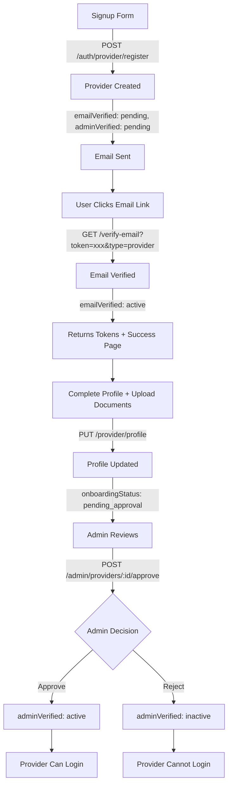

# 🚀 Provider & Admin API Documentation

**Version:** v64  
**Last Updated:** December 4, 2025  
**Base URL:** https://metromatrix-api-2e35f5f074df.herokuapp.com

---

## 📋 Table of Contents
1. [Provider Flow Overview](#provider-flow-overview)
2. [Flag System](#flag-system)
3. [Provider APIs](#provider-apis)
4. [Admin APIs](#admin-apis)
5. [Schema Reference](#schema-reference)

---

## 🎯 Provider Flow Overview



**Simple Steps:**
1. Provider fills signup form → Backend creates provider with flags: `emailVerified: 'pending'`, `adminVerified: 'pending'`
2. Provider clicks email link → Backend sets `emailVerified: 'active'` and shows success page
3. Provider completes profile + uploads documents → Backend updates profile
4. Admin reviews → Sets `adminVerified: 'active'` or `'inactive'`
5. Provider logs in → Only if both flags are `'active'`

---

## 🚩 Flag System

### emailVerified Flag
**Type:** String  
**Values:** `'pending'` | `'active'` | `'inactive'`

- `pending` - Email not verified yet (initial state)
- `active` - Email verified successfully
- `inactive` - Email verification failed/revoked (rare)

### adminVerified Flag
**Type:** String  
**Values:** `'pending'` | `'active'` | `'inactive'`

- `pending` - Awaiting admin approval (initial state)
- `active` - Admin approved, provider can login
- `inactive` - Admin rejected, provider cannot login

### Login Requirements
Provider can **ONLY** login when:
- `emailVerified === 'active'` **AND**
- `adminVerified === 'active'`

---

## 📡 Provider APIs

### 1. Provider Registration (Signup)

**Endpoint:** `POST /api/auth/provider/register`  
**Authentication:** None (Public)  
**Purpose:** Create new provider account

#### Request Body:
```json
{
  "fullName": "Dr. John Smith",
  "email": "john@example.com",
  "phoneNumber": "+1234567890",
  "password": "SecurePass123"
}
```

#### Response (Success - 201):
```json
{
  "success": true,
  "message": "Provider registered successfully. Please verify your email.",
  "provider": {
    "_id": "507f1f77bcf86cd799439011",
    "email": "john@example.com",
    "phoneNumber": "+1234567890",
    "fullName": "Dr. John Smith",
    "emailVerified": "pending",
    "adminVerified": "pending",
    "status": "pending_email_verification",
    "createdAt": "2025-12-04T10:30:00Z"
  }
}
```

#### Response (Error - 400):
```json
{
  "success": false,
  "message": "Email already registered",
  "error": "DUPLICATE_EMAIL"
}
```

#### What Happens:
1. ✅ Provider created in database
2. ✅ Flags set: `emailVerified: 'pending'`, `adminVerified: 'pending'`
3. ✅ Verification email sent with link
4. ❌ NO tokens returned (needs email verification first)

---

### 2. Email Verification (API Endpoint)

**Endpoint:** `GET /api/verify-email?token={token}&type=provider`  
**Authentication:** None (Public)  
**Purpose:** Verify provider email via API call

#### Request Parameters:
```
token: "eyJhbGciOiJIUzI1NiIsInR5cCI6IkpXVCJ9..."
type: "provider"
```

#### Response (Success - 200):
```json
{
  "success": true,
  "message": "Email verified successfully. Please complete your profile.",
  "userType": "provider",
  "provider": {
    "_id": "507f1f77bcf86cd799439011",
    "email": "john@example.com",
    "phoneNumber": "+1234567890",
    "fullName": "Dr. John Smith",
    "emailVerified": "active",
    "adminVerified": "pending",
    "status": "email_verified"
  },
  "accessToken": "eyJhbGciOiJIUzI1NiIsInR5cCI6IkpXVCJ9...",
  "refreshToken": "eyJhbGciOiJIUzI1NiIsInR5cCI6IkpXVCJ9..."
}
```

#### Response (Error - 400):
```json
{
  "success": false,
  "message": "Invalid or expired verification token",
  "statusCode": 400
}
```

#### What Happens:
1. ✅ Email verified: `emailVerified: 'active'`
2. ✅ Status updated: `onboardingStatus: 'pending_documents'`
3. ✅ **Tokens returned** (for profile completion)
4. ✅ Frontend can now call profile update endpoint

---

### 3. Email Verification (Web Page)

**Endpoint:** `GET /verify-email?token={token}&type=provider`  
**Authentication:** None (Public)  
**Purpose:** Verify provider email when clicking link in email (opens in browser)

#### Request Parameters:
```
token: "eyJhbGciOiJIUzI1NiIsInR5cCI6IkpXVCJ9..."
type: "provider"
```

#### Response:
Returns HTML success page with deep link containing tokens:
```
metromatrix://verify-success?verified=true&accessToken=xxx&refreshToken=xxx&userType=provider&userId=xxx&email=xxx&fullName=xxx
```

#### What Happens:
1. ✅ Email verified: `emailVerified: 'active'`
2. ✅ Tokens generated
3. ✅ Success page shown with "Return to App" button
4. ✅ Deep link opens mobile app with tokens in URL

---

### 4. Update Provider Profile + Documents

**Endpoint:** `PUT /api/provider/profile`  
**Authentication:** **Required** (Bearer Token)  
**Purpose:** Complete profile and upload documents after email verification

#### Request Headers:
```
Authorization: Bearer {accessToken}
Content-Type: multipart/form-data
```

#### Request Body (Form Data):
```
// Text Fields
fullName: "Dr. John Smith"
email: "john@example.com"
phoneNumber: "+1234567890"
city: "New York"
providerType: "doctor"
specialty: "Cardiology"
experience: "10"
rate: "150"
briefDescription: "Experienced cardiologist..."
professionalName: "Dr. John Smith, MD"
idNumber: "ABC123"

// Document Files (multipart/form-data)
medicalLicense: File (PDF/Image)
degreeCertificate: File (PDF/Image)
nationalIdCard: File (PDF/Image)
professionalCertificate: File (PDF/Image)
businessLicense: File (PDF/Image)
insuranceDocument: File (PDF/Image)
profilePhoto: File (Image)
additionalCertificates: File[] (up to 5 files)
```

#### Response (Success - 200):
```json
{
  "success": true,
  "message": "Profile updated and submitted for admin approval",
  "provider": {
    "_id": "507f1f77bcf86cd799439011",
    "email": "john@example.com",
    "fullName": "Dr. John Smith",
    "emailVerified": "active",
    "adminVerified": "pending",
    "status": "pending_approval",
    "city": "New York",
    "providerType": "doctor",
    "documents": {
      "medicalLicense": {
        "url": "https://res.cloudinary.com/...",
        "key": "providers/507f1f77bcf86cd799439011/medical-license.pdf",
        "uploadedAt": "2025-12-04T11:00:00Z"
      },
      "degreeCertificate": {
        "url": "https://res.cloudinary.com/...",
        "key": "providers/507f1f77bcf86cd799439011/degree.pdf",
        "uploadedAt": "2025-12-04T11:00:00Z"
      }
    },
    "submittedAt": "2025-12-04T11:00:00Z",
    "updatedAt": "2025-12-04T11:00:00Z"
  },
  "submissionId": "507f1f77bcf86cd799439011"
}
```

#### Response (Error - 401):
```json
{
  "success": false,
  "message": "Authentication required",
  "error": "UNAUTHORIZED"
}
```

#### Response (Error - 403):
```json
{
  "success": false,
  "message": "Please verify your email first",
  "error": "EMAIL_NOT_VERIFIED",
  "emailVerified": "pending"
}
```

#### What Happens:
1. ✅ Profile fields updated
2. ✅ Documents uploaded to Cloudinary
3. ✅ Status updated: `onboardingStatus: 'pending_approval'`
4. ✅ Admin notification email sent
5. ✅ Provider can now poll approval status

#### File Limits:
- Max file size: 10MB per file
- Max total files: 15 per request
- Supported formats: PDF, JPEG, JPG, PNG, GIF

---

### 5. Check Approval Status

**Endpoint:** `GET /api/provider/approval-status?email={email}`  
**Authentication:** None (Public)  
**Purpose:** Check provider approval status (for polling/waiting screen)

#### Request Parameters:
```
email: "john@example.com"
```

#### Response (Pending - 200):
```json
{
  "success": true,
  "status": "pending_approval",
  "message": "Your application is under review by our admin team.",
  "provider": {
    "_id": "507f1f77bcf86cd799439011",
    "fullName": "Dr. John Smith",
    "email": "john@example.com",
    "providerType": "doctor",
    "emailVerified": "active",
    "adminVerified": "pending"
  },
  "submittedAt": "2025-12-04T11:00:00Z"
}
```

#### Response (Approved - 200):
```json
{
  "success": true,
  "status": "approved",
  "message": "Your account has been approved! You can now sign in.",
  "provider": {
    "_id": "507f1f77bcf86cd799439011",
    "fullName": "Dr. John Smith",
    "email": "john@example.com",
    "providerType": "doctor",
    "emailVerified": "active",
    "adminVerified": "active"
  },
  "approvedAt": "2025-12-04T12:00:00Z",
  "approvedBy": {
    "adminId": "507f1f77bcf86cd799439012",
    "adminName": "Admin User"
  }
}
```

#### Response (Rejected - 200):
```json
{
  "success": true,
  "status": "rejected",
  "message": "Your application was not approved.",
  "provider": {
    "_id": "507f1f77bcf86cd799439011",
    "fullName": "Dr. John Smith",
    "email": "john@example.com",
    "providerType": "doctor",
    "emailVerified": "active",
    "adminVerified": "inactive"
  },
  "rejectionReason": "Invalid medical license number. Please contact support.",
  "rejectedAt": "2025-12-04T12:00:00Z",
  "rejectedBy": {
    "adminId": "507f1f77bcf86cd799439012",
    "adminName": "Admin User"
  }
}
```

#### What Happens:
1. ✅ Returns current approval status
2. ✅ Frontend polls this every 30 seconds while waiting
3. ✅ When `adminVerified: 'active'`, navigate to login
4. ✅ When `adminVerified: 'inactive'`, show rejection message

---

### 6. Provider Login

**Endpoint:** `POST /api/auth/provider/login`  
**Authentication:** None (Public)  
**Purpose:** Login provider after email verification and admin approval

#### Request Body:
```json
{
  "email": "john@example.com",
  "password": "SecurePass123"
}
```

#### Response (Success - 200):
```json
{
  "success": true,
  "message": "Login successful",
  "accessToken": "eyJhbGciOiJIUzI1NiIsInR5cCI6IkpXVCJ9...",
  "refreshToken": "eyJhbGciOiJIUzI1NiIsInR5cCI6IkpXVCJ9...",
  "provider": {
    "_id": "507f1f77bcf86cd799439011",
    "fullName": "Dr. John Smith",
    "email": "john@example.com",
    "phoneNumber": "+1234567890",
    "emailVerified": "active",
    "adminVerified": "active",
    "status": "approved",
    "providerType": "doctor",
    "specialty": "Cardiology",
    "city": "New York",
    "profileComplete": true
  }
}
```

#### Response (Error - Invalid Credentials - 401):
```json
{
  "success": false,
  "message": "Invalid email or password",
  "error": "INVALID_CREDENTIALS"
}
```

#### Response (Error - Email Not Verified - 403):
```json
{
  "success": false,
  "message": "Please verify your email before logging in",
  "error": "EMAIL_NOT_VERIFIED",
  "emailVerified": "pending"
}
```

#### Response (Error - Not Approved - 403):
```json
{
  "success": false,
  "message": "Your account is pending admin approval. You will receive an email once approved.",
  "error": "ACCOUNT_NOT_APPROVED",
  "emailVerified": "active",
  "adminVerified": "pending",
  "status": "pending_approval"
}
```

#### Response (Error - Rejected - 403):
```json
{
  "success": false,
  "message": "Your application was not approved. Please contact support for details.",
  "error": "ACCOUNT_REJECTED",
  "emailVerified": "active",
  "adminVerified": "inactive",
  "status": "rejected",
  "rejectionReason": "Invalid medical license number"
}
```

#### Login Checks (in order):
1. ✅ Verify email and password match
2. ✅ Check `emailVerified === 'active'`
3. ✅ Check `adminVerified === 'active'`
4. ✅ If all pass, return tokens

---

## 🔐 Admin APIs

### 1. Get All Providers (Admin Dashboard)

**Endpoint:** `GET /api/admin/providers`  
**Authentication:** **Required** (Admin Token)  
**Purpose:** Get list of all providers for admin dashboard

#### Request Headers:
```
Authorization: Bearer {admin_token}
```

#### Request Query Parameters:
```
page: 1 (default)
limit: 10 (default)
status: "pending" | "approved" | "rejected" (optional)
search: "john" (optional - searches name and email)
```

#### Response (Success - 200):
```json
{
  "success": true,
  "providers": [
    {
      "_id": "507f1f77bcf86cd799439011",
      "fullName": "Dr. John Smith",
      "email": "john@example.com",
      "phoneNumber": "+1234567890",
      "providerType": "doctor",
      "specialty": "Cardiology",
      "city": "New York",
      "emailVerified": "active",
      "adminVerified": "pending",
      "verificationStatus": "pending",
      "onboardingStatus": "pending_approval",
      "profileComplete": true,
      "submittedAt": "2025-12-04T11:00:00Z",
      "createdAt": "2025-12-04T10:30:00Z"
    }
  ],
  "pagination": {
    "currentPage": 1,
    "totalPages": 5,
    "totalProviders": 50,
    "limit": 10
  }
}
```

---

### 2. Get Provider Details (Admin)

**Endpoint:** `GET /api/admin/providers/:id`  
**Authentication:** **Required** (Admin Token)  
**Purpose:** Get detailed information about a specific provider

#### Request Headers:
```
Authorization: Bearer {admin_token}
```

#### Response (Success - 200):
```json
{
  "success": true,
  "provider": {
    "_id": "507f1f77bcf86cd799439011",
    "fullName": "Dr. John Smith",
    "email": "john@example.com",
    "phoneNumber": "+1234567890",
    "providerType": "doctor",
    "specialty": "Cardiology",
    "experience": "10",
    "city": "New York",
    "rate": "150",
    "briefDescription": "Experienced cardiologist...",
    "professionalName": "Dr. John Smith, MD",
    "idNumber": "ABC123",
    "emailVerified": "active",
    "adminVerified": "pending",
    "documents": {
      "medicalLicense": {
        "url": "https://res.cloudinary.com/...",
        "name": "medical-license.pdf",
        "uploadedAt": "2025-12-04T11:00:00Z",
        "verified": false
      },
      "degreeCertificate": {
        "url": "https://res.cloudinary.com/...",
        "name": "degree-certificate.pdf",
        "uploadedAt": "2025-12-04T11:00:00Z",
        "verified": false
      },
      "nationalIdCard": {
        "url": "https://res.cloudinary.com/...",
        "name": "id-card.pdf",
        "uploadedAt": "2025-12-04T11:00:00Z",
        "verified": false
      }
    },
    "submittedAt": "2025-12-04T11:00:00Z",
    "createdAt": "2025-12-04T10:30:00Z",
    "updatedAt": "2025-12-04T11:00:00Z"
  }
}
```

---

### 3. Approve Provider

**Endpoint:** `POST /api/admin/providers/:id/approve`  
**Authentication:** **Required** (Admin Token)  
**Purpose:** Approve provider application (sets adminVerified to 'active')

#### Request Headers:
```
Authorization: Bearer {admin_token}
```

#### Request Body:
```json
{
  // Optional: No body required, or can include notes
}
```

#### Response (Success - 200):
```json
{
  "success": true,
  "message": "Provider approved successfully. FULL access token issued.",
  "provider": {
    "id": "507f1f77bcf86cd799439011",
    "fullName": "Dr. John Smith",
    "email": "john@example.com",
    "onboardingStatus": "approved",
    "verificationStatus": "approved"
  },
  "tokens": {
    "accessToken": "eyJhbGciOiJIUzI1NiIsInR5cCI6IkpXVCJ9...",
    "refreshToken": "eyJhbGciOiJIUzI1NiIsInR5cCI6IkpXVCJ9..."
  },
  "tokenType": "FULL"
}
```

#### What Happens:
1. ✅ `adminVerified` set to `'active'`
2. ✅ `verificationStatus` set to `'approved'`
3. ✅ `onboardingStatus` set to `'approved'`
4. ✅ `isVerified` set to `true`
5. ✅ `canLogin` set to `true`
6. ✅ `approvedAt` timestamp set
7. ✅ Approval email sent to provider
8. ✅ Provider can now login

---

### 4. Reject Provider

**Endpoint:** `POST /api/admin/providers/:id/reject`  
**Authentication:** **Required** (Admin Token)  
**Purpose:** Reject provider application (sets adminVerified to 'inactive')

#### Request Headers:
```
Authorization: Bearer {admin_token}
```

#### Request Body:
```json
{
  "reason": "Invalid medical license number. Please contact support for verification."
}
```

#### Response (Success - 200):
```json
{
  "success": true,
  "message": "Provider rejected successfully"
}
```

#### What Happens:
1. ✅ `adminVerified` set to `'inactive'`
2. ✅ `verificationStatus` set to `'rejected'`
3. ✅ `rejectionReason` saved
4. ✅ `rejectedAt` timestamp set
5. ✅ Rejection email sent to provider
6. ✅ Provider **cannot** login

---

## 📊 Schema Reference

### Provider Schema

```javascript
{
  // Basic Info
  fullName: String (required),
  email: String (required, unique, lowercase),
  password: String (required, hashed),
  phoneNumber: String (required),
  profilePhoto: String,
  
  // Provider Type
  providerType: String, // 'doctor' | 'home_service' | 'vendor' | 'pending'
  providerSubType: String, // 'electrician' | 'plumber' | 'ac_repairer' | null
  
  // Professional Info
  specialty: String, // For doctors
  profession: String, // For home_service
  category: String, // For vendors
  experience: String,
  briefDescription: String (max 500 chars),
  rate: String,
  professionalName: String, // Clinic name for doctors
  businessName: String, // For vendors
  
  // Location
  city: String,
  serviceAreas: [String],
  address: {
    street: String,
    city: String,
    postalCode: String,
    country: String (default: 'Pakistan')
  },
  
  // Identification
  idNumber: String,
  
  // Documents
  documents: {
    medicalLicense: {
      name: String,
      url: String,
      publicId: String,
      uploadedAt: Date,
      verified: Boolean (default: false)
    },
    degreeCertificate: { /* same structure */ },
    professionalCertificate: { /* same structure */ },
    businessLicense: { /* same structure */ },
    nationalIdCard: { /* same structure */ }
  },
  
  // ✅ NEW FLAG SYSTEM
  emailVerified: String, // 'pending' | 'active' | 'inactive'
  adminVerified: String, // 'pending' | 'active' | 'inactive'
  
  // Onboarding
  onboardingStatus: String,
  // 'pending_email' | 'pending_documents' | 'pending_approval' | 'approved' | 'rejected'
  profileComplete: Boolean (default: false),
  
  // Verification Tokens
  emailVerificationToken: String,
  emailVerificationExpire: Date,
  
  // Admin Review
  rejectionReason: String,
  verifiedBy: ObjectId (ref: 'Admin'),
  approvedAt: Date,
  rejectedAt: Date,
  
  // Legacy Fields (backward compatibility)
  verificationStatus: String, // 'pending' | 'approved' | 'rejected'
  isVerified: Boolean (default: false),
  canLogin: Boolean (default: false),
  
  // Timestamps
  createdAt: Date,
  updatedAt: Date
}
```

---

## 🔄 Complete Flow Example

### Frontend Implementation:

```javascript
// 1. SIGNUP
const signup = async (data) => {
  const response = await fetch('https://metromatrix-api-2e35f5f074df.herokuapp.com/api/auth/provider/register', {
    method: 'POST',
    headers: { 'Content-Type': 'application/json' },
    body: JSON.stringify(data)
  });
  const result = await response.json();
  
  if (result.success) {
    // Show: "Please check your email to verify your account"
    // Navigate to: Email verification waiting screen
    return result.provider;
  }
};

// 2. EMAIL VERIFICATION (User clicks link in email)
// Backend handles this automatically
// Returns success page with deep link: metromatrix://verify-success?accessToken=xxx&refreshToken=xxx

// 3. AFTER EMAIL VERIFIED (App receives tokens from deep link)
const completeProfile = async (formData, accessToken) => {
  const response = await fetch('https://metromatrix-api-2e35f5f074df.herokuapp.com/api/provider/profile', {
    method: 'PUT',
    headers: {
      'Authorization': `Bearer ${accessToken}`
    },
    body: formData // FormData with files
  });
  const result = await response.json();
  
  if (result.success) {
    // Navigate to: Waiting for approval screen
    // Start polling approval status
    startPolling(result.provider.email);
  }
};

// 4. POLL APPROVAL STATUS (Every 30 seconds)
const checkApprovalStatus = async (email) => {
  const response = await fetch(`https://metromatrix-api-2e35f5f074df.herokuapp.com/api/provider/approval-status?email=${email}`);
  const result = await response.json();
  
  if (result.provider.adminVerified === 'active') {
    // Approved! Navigate to login screen
    alert('Your account has been approved! You can now sign in.');
    navigation.navigate('Login');
  } else if (result.provider.adminVerified === 'inactive') {
    // Rejected
    alert(`Application rejected: ${result.rejectionReason}`);
    navigation.navigate('Home');
  } else {
    // Still pending, continue polling
    setTimeout(() => checkApprovalStatus(email), 30000);
  }
};

// 5. LOGIN (After admin approval)
const login = async (email, password) => {
  const response = await fetch('https://metromatrix-api-2e35f5f074df.herokuapp.com/api/auth/provider/login', {
    method: 'POST',
    headers: { 'Content-Type': 'application/json' },
    body: JSON.stringify({ email, password })
  });
  const result = await response.json();
  
  if (result.success) {
    // Save tokens and navigate to dashboard
    await AsyncStorage.setItem('accessToken', result.accessToken);
    await AsyncStorage.setItem('refreshToken', result.refreshToken);
    navigation.navigate('Dashboard');
  } else {
    // Handle errors
    if (result.error === 'EMAIL_NOT_VERIFIED') {
      alert('Please verify your email first');
    } else if (result.error === 'ACCOUNT_NOT_APPROVED') {
      alert('Your account is pending admin approval');
    } else if (result.error === 'ACCOUNT_REJECTED') {
      alert(`Account rejected: ${result.rejectionReason}`);
    }
  }
};
```

---

## ✅ Testing Checklist

### Provider Flow:
- [ ] Register new provider
- [ ] Receive verification email
- [ ] Click email link → See success page
- [ ] Check that emailVerified changed to 'active'
- [ ] Complete profile with documents
- [ ] Poll approval status
- [ ] Try to login before approval → Get error
- [ ] Admin approves
- [ ] Check approval status → See 'active'
- [ ] Login successfully

### Admin Flow:
- [ ] Get all providers list
- [ ] View provider details
- [ ] Approve provider → Check flags changed
- [ ] Reject provider → Check flags changed
- [ ] Verify approval/rejection emails sent

---

## 🔧 Environment Variables

```bash
JWT_SECRET=your_jwt_secret
ADMIN_EMAIL=admin@metromatrix.com
API_URL=https://metromatrix-api-2e35f5f074df.herokuapp.com
CLIENT_URL=https://metromatrix.com
MONGODB_URI=mongodb+srv://...
CLOUDINARY_CLOUD_NAME=your_cloud_name
CLOUDINARY_API_KEY=your_api_key
CLOUDINARY_API_SECRET=your_api_secret
```

---

## 📞 Support

If you encounter any issues:
1. Check this document for correct request/response formats
2. Verify flag values match expected: `'pending'`, `'active'`, `'inactive'`
3. Check network tab for exact error responses
4. Contact backend team with specific error messages

---

**✅ All endpoints are live and ready for integration!**
